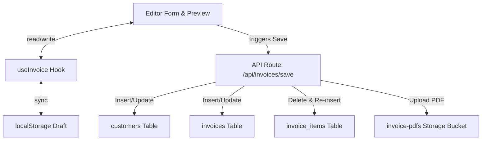

# Architecture Context: Invoice System

## Tech Stack
- **Framework**: Next.js 16 (App Router) + React 19
- **Styling**: Tailwind CSS v4 + Tailwind Animate (CSS variables for theming)
- **Database / Backend**: Supabase (via `@supabase/supabase-js`)
- **AI Processing**: Google Generative AI (`@google/generative-ai` SDK with Gemini models)
- **Libraries**:
  - `react-signature-canvas` for drawing signatures
  - `react-to-print` / browser printing API for A4 page printing
  - `pdf-parse-new` & `pdfjs-dist` for client/server side PDF text extraction

---

## Directory Layout & Boundaries

```
├── lib/                     # Global libraries (e.g. supabase client instance)
├── src/
│   ├── app/                 # Next.js Pages & API Route Handlers
│   │   ├── api/             # REST Endpoints (ai-invoice, invoices/save, products)
│   │   ├── dashboard/       # Dashboard Layout & Sub-views (invoices, customers, etc.)
│   │   └── login/           # Authentication page
│   ├── components/          # React components
│   │   ├── dashboard/       # Dashboard-specific widgets
│   │   ├── ui/              # Low-level UI elements (select, dialog, dropdown, input)
│   │   └── invoice/         # Invoice Editor, Preview, and Print Layouts
│   ├── constants/           # Global constants
│   ├── hooks/               # React Custom Hooks
│   │   ├── useInvoice.ts    # Central state singleton management
│   │   └── useInvoicePrint.ts
│   ├── lib/                 # Core utilities & local storage helpers
│   ├── modules/             # Business Logic & Schemas
│   │   └── invoice/         # Type declarations, schema validations, math calculators
│   ├── styles/              # Global css and print layout styles
│   └── utils/               # Pure helper functions (e.g. amount to words converter)
```

---

## Central State & Data Flow


1. **Singleton State**: The active invoice state is maintained as a singleton inside `src/hooks/useInvoice.ts`. Every call to `useInvoice` subscribes to the same shared state and updates are flushed to `localStorage` key `invoice_draft`.
2. **Calculations**: Any item update triggers pure math recalculations in `src/modules/invoice/invoice.calculator.ts` to compute subtotal, SGST, CGST, and Grand Total.
3. **Save Operations**: The screen elements do not talk to Supabase directly. To save an invoice, the UI uploads a serialized form data payload to `/api/invoices/save` which executes the transactions sequentially.

---

## Data Schema & Entities
From our API routes, we target the following Supabase tables:

1. **`customers` Table**:
   - `id` (UUID, PK)
   - `name` (text)
   - `phone` (text)
   - `address` (text)
   - `aadhaar` (text)

2. **`invoices` Table**:
   - `id` (UUID, PK)
   - `invoice_number` (text)
   - `customer_id` (UUID, FK to `customers`)
   - `customer_name` (text)
   - `invoice_type` (text, e.g., 'invoice' | 'quote')
   - `subtotal` (numeric)
   - `sgst` (numeric)
   - `cgst` (numeric)
   - `total` (numeric)
   - `pdf_url` (text)
   - `business_name` (text)
   - `business_address` (text)
   - `business_phone` (text)
   - `business_gstin` (text)

3. **`invoice_items` Table**:
   - `id` (UUID, PK)
   - `invoice_id` (UUID, FK to `invoices`)
   - `product_name` (text)
   - `quantity` (integer)
   - `unit_price` (numeric)
   - `total` (numeric)

---

## Strict Architectural Invariants
All code changes must adhere to the following rules:

1. **No External Store Libraries**: Do not introduce Redux, Zustand, Recoil, or MobX for invoice state management. The hook `useInvoice.ts` provides a custom singleton listener model which is fully sufficient.
2. **Standardized Calculations**: Never write custom, localized calculations for subtotals or taxes in components. You must import `calculateInvoiceTotals` or `calculateItemTotal` from `src/modules/invoice/invoice.calculator.ts`.
3. **No Direct Database Access in Components**: All mutations must go through API route handlers (`src/app/api/...`) or React Server Actions. The client must never call `supabase.from('invoices').insert(...)` directly.
4. **Preserve PDF Printing System**: The user explicitly requested **no changes** to the high-fidelity A4 browser printing and layout engine. Do not alter `.no-print` and `@page { size: A4 }` settings in `src/app/globals.css` or dedicated print sheets unless requested.
5. **No Database schema drift**: When making database queries, ensure they are compatible with the table structures above and leverage Supabase Postgres best practices.
